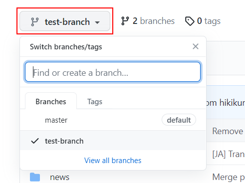
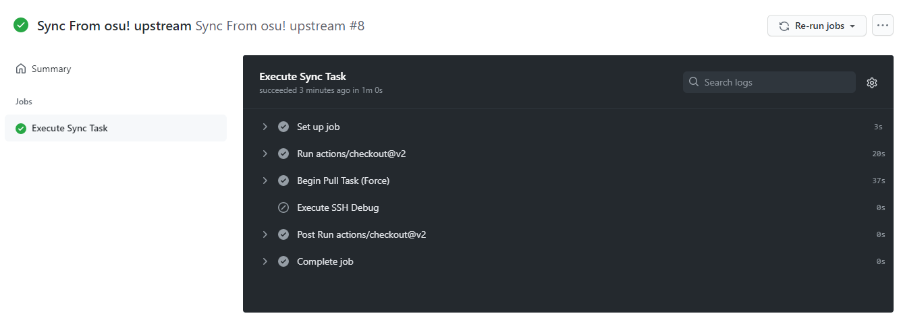

# Common issues for wiki contributors

## Someone told me to use meaningful commit messages!

This can also be phrased as, "All of my commits say `Update en.md`," or similar.

If someone has told you this or you see that all of your commit messages are the same, this means you didn't use meaningful commit messages when you were able to or you tried to move, edit, and/or delete multiple files using the GitHub web interface.

A meaningful commit message lets anyone understand all of your changes within that commit without needing to see the GitHub diff. There is a 72 character limit for the commit message, so you will need to also make it short. If you have troubles trying to keep it short, you may need to split your commits. **Keep in mind that `Update en.md` or similar does not mean anything, because no one will know what specific changes you have made, nor will they know which article you had changed.**

---

To resolve this, you need to use GitHub Web Interface:

1. Go to your fork of the `osu-wiki` repo.
2. Create a new branch. Name it the same thing as your problematic branch and append a number, or name it whatever you want.
3. Create a pull request.
4. If the `base fork` and `head fork` dropdown menus aren't present, click the `compare across forks` link.
5. Change `head fork` to your fork.
6. Change `compare` to your problematic branch.
7. Change `base fork` to your fork.
8. Change `base` to your new branch.
9. Click `Create pull request`.
10. Ignore the title and description box and click `Create pull request` again.
11. Scroll down to the end of the timeline and click on the down arrow next to the `Merge pull request` button.
12. Click `Squash and merge`.
13. Click `Squash and merge` again.
14. Fix the title (this will be the commit message; make sure it is meaningful).
15. Fix the description (this will be the commit description; this is optional, but make sure you change it).
16. Click `Confirm squash and merge`.
17. Go to the [`ppy/osu-wiki` repo](https://github.com/ppy/osu-wiki).
18. Close your pull request that has the problematic branch.
19. Open a new pull request using the new branch.
20. You can copy the description of the closed pull request into the new one you just opened. It is helpful to also include a reference to the other pull request you had closed.
21. Click `Create pull request`. You are now done with fixing your commits. If you have completed the reviews from the closed pull request and you are certain that the pull request is ready to be merged, ask someone to merge it.

Technically, this is the best way to squash commits from a branch when limited to only using the GitHub Web Interface. It is impossible to squash commits using GitHub Desktop.

## My branch is out of date!

*Note: `master` is the main branch of your fork repository. It should contain a clean copy of `osu-wiki` repository's `master` branch contents without any personal edits.*

When you created your fork of the `osu-wiki` repo, you took a snapshot of the contents at that very moment. Fortunately, GitHub has a built-in feature that allows you to keep your branch up-to-date.

1. Go to your fork of the `osu-wiki` repo.
2. Select the branch, that you intend to update, from the dropdown.

3. Click `Fetch upstream`, and select `Fetch and merge`.

Now your branch will be up-to-date with the upstream repository!

---

This solution works fine in most cases, although the feature itself has limited capabilities. For example, it doesn't allow you to overwrite any unwanted changes on the branch, as it only merges the upstream `master` branch.

If you encountered any problems while using the GitHub tool or you want to overwrite your branch's contents, you can use the workflow written by the osu! wiki contributors.

1. Open **your fork** and go to the `Actions` tab.
2. In `Workflows`, look for `Sync from osu! upstream`.
3. Click `Run workflow` and fill in the options:

- **Use workflow from**: name of the branch you want to sync. By default, it is set to `master`.
- **Overwrite any changes in the target repository**:
  - `true`: replace the contents of your branch with a clean copy of the `master` branch from `ppy/osu-wiki`.
  - `false` (default): merge your changes with these from `ppy/osu-wiki`.
- **Create a backup of your target branch**:
  - `true`:  make a branch called `backup-{name of your branch}` before changing it.
  - `false` (default): do not make any backups.

4. Click the `Run Workflow` button and wait for the workflow to complete. If you're curious how the tool works, click on the `Sync from osu! upstream` workflow task.

## My pull request has conflicts!

There are two reasons for why this could have happened:

- You edited a file when your branch was out of date.
- There was poor communication between you and another person, so you two were editing the same article but that person's changes were merged before yours (technically, this caused your edited files to become out of date).

Depending on the severity of the conflicts, you may have two options to fix this.

1. If your pull request has the `Resolve conflicts` button, click on that. This will open a slightly different version of the web editor.
   1. GitHub will highlight the conflicting areas. Find one of them.
   2. Everything from `<<<<<<<` to the `=======` is your changes, whereas everything from `=======` to `>>>>>>> master` is what's in the `ppy/master` branch.
   3. From here, you will need to manually fix the conflict and delete the `<<<<<<<`, the `=======`, and `>>>>>>> master` markings.
   4. Repeat the process for all conflicts.
   5. When completed, click `Mark as resolved` (this is only available when all conflicting parts of the file are resolved).
2. If the `Resolve conflicts` button is blocked due to the conflicts being too complicated for GitHub, you are out of luck and will need to [update your branch](#my-branch-is-out-of-date!) and make your changes again.
   - *Note: This is only true if you are limited to using GitHub Web Interface.* There are still ways to fix it, but it will not be covered in this article, and it may not be worth the effort to do so, because you will overwrite and revert the conflicting changes.
